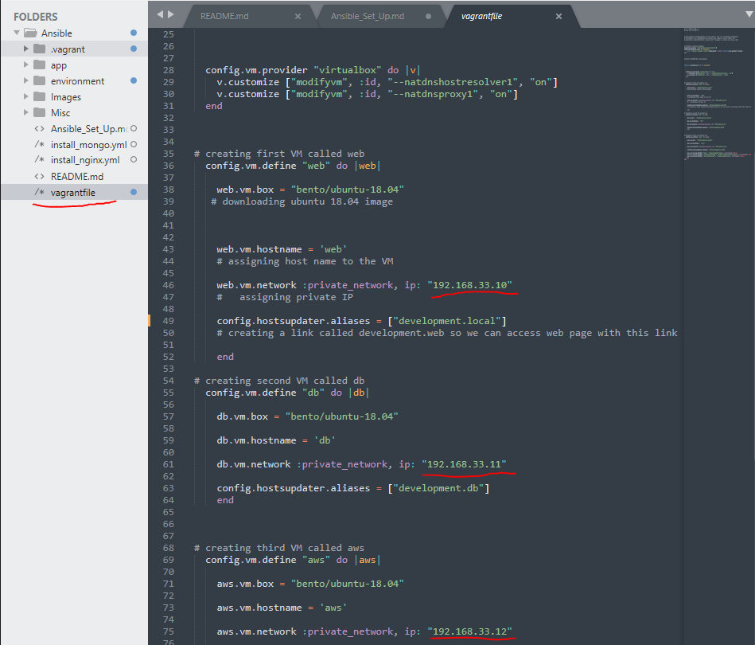
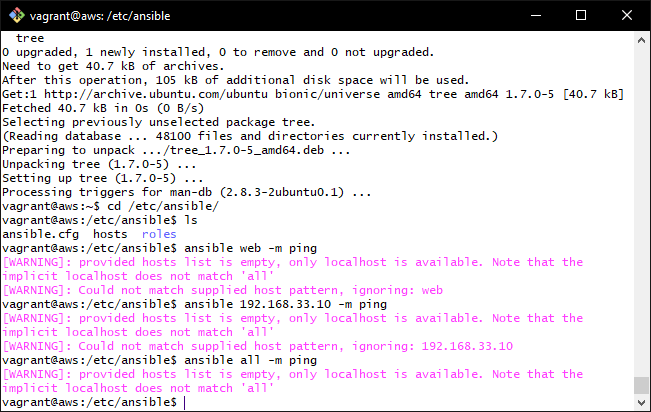
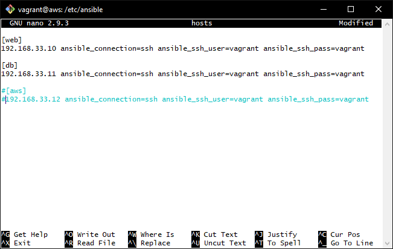
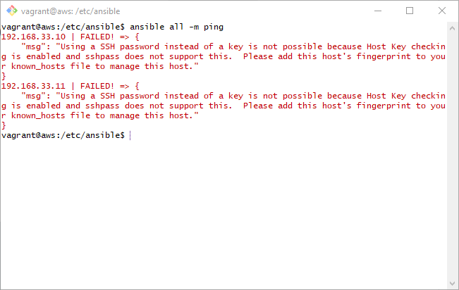
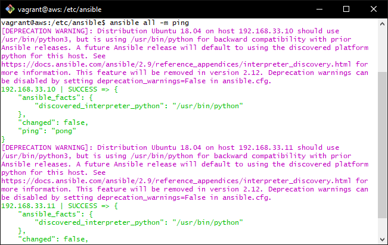

# Setting up an Ansible Controller

## Set up Ansible Controller within a instance created using Vagrant and hosted on Oracle VM VirtualBox

This first thing you need to do is clone this repository into a folder on your computer. If you need to know how to clone the repository then this [website](https://docs.github.com/en/enterprise/2.13/user/articles/cloning-a-repository) is useful.

## Step 1

Now we need to Vagrant up so our machines start up and configure themselves.

```bash
# Up the Machines
Vagrant up
```

_**This can take a while**_

To Double check the machines are up you can check the status with vagrant aswell.

```bash
# Check status of Machines
Vagrant status
```

## Step 2

So we have three machines currently:

* **AWS** : This is our Ansible Controller
* **Web** : This is our Web app (**NGINX**)
* **DB** : This is our Database (**MONGODB**)

Now the first we do is to use **SSH** to go into each machine and run the update command.

```bash
# ssh into machine
vagrant ssh <vm_name>

# update source list
sudo apt-get update
```

## Step 3

Now we are going get the relevant dependencies needed by Ansible, also fetch the repository which contains the relevant packages and then update our machines sources list so we can proceed to download the most stable of Ansible.

```bash
# Get dependencies
sudo apt-get install software-properties-common -y

# Get package from Ansible Repo
sudo apt-add-repository ppa:ansible/ansible

# Update sources list
sudo apt-get update -y
```

Finally, Install Ansible!

```bash
# Install ansible with the apt-get package manager
sudo apt-get install ansible

# Check if ansible installed successfully
ansible --version
```

This part is _**optional**_, but I am going to install **tree** a small program to display the list of directory in a tree-like format. It outputs the directory paths and files in each sub-directory and a summary of a total number of sub-directories and files.

```bash
# Install tree 
sudo apt-get install tree
```

## Step 4

We are now going to configure our Ansible controller so it can communicate with the other virtual machines we upped earlier (**web** and **db**).

First to test if we can get a connection, we are going to ping the servers using the IPv4 addresses they were set in the `Vagrant File` on your OS.



_**These will be important in the next couple of steps too so keep this open.**_

But first we need to navigate into ansibles directory.

```bash
# Nav to Ansible Dir
cd /etc/ansible
```
Now lets ping the web server with the ip _**192.168.33.10**_. 

```bash
# use ansible to ping ip address with (-m module)
ansible 192.168.33.10 -m ping
```

You should get a reponse similar to one below, as it cannot actually connect yet as it is not a trusted host, so lets fix that..



To do that we need to add these hosts into our hosts file, so lets navigate in and add them as recognised servers.

```bash
# navigate into hosts (sudo so you can edit it)
sudo nano hosts
```

Now you are inside you will see a lot of placeholder text to explain how to use the file. Add this at the top of file to reference the **AWS** and **DB**, the **AWS** is this server so comment it out for now.

```bash
[web]
192.168.33.10 ansible_connection=ssh ansible_ssh_user=vagrant ansible_ssh_pass=vagrant

[db]
192.168.33.11 ansible_connection=ssh ansible_ssh_user=vagrant ansible_ssh_pass=vagrant

# [aws]
# 192.168.33.12 ansible_connection=ssh ansible_ssh_user=vagrant ansible_ssh_pass=vagrant

```



Now lets try ping again, this time with the all command.

```bash
# Ping all servers in hosts file
ansible all -m ping
```



This should has FAILED except it is now asking us to verify these hosts, to do this we need to SSH into them at least one using the password we set inside the hosts file, in this case its _ansible_ssh_pass=**vagrant**_.

So lets add these hosts now, by doing a **SSH** into both machines.

```bash
# SSH into our VMs
ssh vagrant@<ip_of_VM>
```

When you do this you should get a _**fingerprint**_ confirmation, just type yes. This adds the fingerprint to your known_hosts file meaning it will remember it automatically next time you SSH into this particular VM.

Then you need to enter the password _**vagrant**_ and enter to enter the VM. Then exit and **Repeat this for both VMs**.

Now lets try connect to the VMs again using that same ping command with ansible.

```bash
# Ping all servers in hosts file
ansible all -m ping
```

This time you should see this output!



It was a **SUCCESS** this means that ansible has got a connection with the two other VMs we have running on our Oracle Virtualbox.

If you want to try some other commands, and see the power of Ansible then try out some of these **Ad-hoc commands**.

##ADHOC Commands

These are single line tasks that automate a single task, like installing nginx or retrieving the environment variables. Ad-hoc commands demonstrate the simplicity and power of Ansible.

```bash
# get time of VM (Will be local time)
ansible all -a "date"

# Get Machine name, E.G. version that is running (last -a) means all info
ansible all -a "uname -a"

# Run the ls to list files in that particularly home dir of our VMs
ansible all -m shell -a "ls a"

# Check the free space available in our VMs
ansible all -m shell -a "free"

# Check environment variables inside a VM
ansible all -m shell -a "env"

# Check uptime of VM
ansuble all -m shell -a "uptime"

# Get Ipv4 of VM
ansible db -m shell -a "hostname -i"
```

## Step 5

Now we are going to create what is known as a playbook, simply put a playbook is the basis of configuration management and mult-machine deployment system. Playbooks can declare configurations, but they can also orchestrate steps of any manual ordered process, even as different steps must bounce back and forth between sets of machines in particular orders. They can launch tasks synchronously or asynchronously.

_**For more information go [HERE](https://docs.ansible.com/ansible/latest/user_guide/playbooks_intro.html)**_

Playbooks are written in the scripting language **YAML** or **YML**, a very popular language closely related to python in its simplicity.

Lets create our first playbook to get nginx up on our web VM.

```bash
# Create app playbook
touch install_nginx.yml 
```

One thing to keep in mind with playbooks, is that they are rather unforgiving when it comes to syntax. The indentation is crucial or it will throw errors. A **Tip** is to always use spaces and never tabs as they aren't recognised in this langauge.

Before we continue lets create two more playbooks, one for provisioning a database running `MongoDB` and another to add an environment variable into our `App` VM so it can remember the Databases location when we try to open the posts part of it.

```bash
# Create app playbook
touch install_mongo.yml 

# Create app playbook
touch env_var_in_app.yml 
```

## Step 6

Now lets populate our ansible playbooks, starting with the app.

```bash
# Make sure your in the ansible directory
cd /etc/ansible

# nano into the install_nginx.yml playbook
nano install_nginx.yml
```

_**Explanation of Playbook syntax**_

_This section is only necessary if you are interested in knowing how the playbook is formatted/ functions_

The top of the playbook looks like this

```yaml
# Tells the interpreter it is YAML/YML file
---

 # Define hosts to target, can put all here too
-hosts: <name_of_VM>, <name_of_2nd_VM>
 
 # Gather facts of the VM, such as free space, ip ECT..
 gather facts: yes

 # Gives the playbook provisioning root permissions
 become: yes  
```

The rest of the playbook contains steps/ tasks that are carried out to perform the task. Now go into each of these playbooks we have created and copy and paste in the contents of the .yml files in your directory. 

_**Make sure the file has `---` at the top of the file!**_

1. `Nano install_nginx.yml`, paste in contents, save
2. `Nano install_mongo.yml`, paste in contents, save
3. `Nano env_var_in_app.yml`, paste in contents, save

Now we have successfully set up these playbooks and they will do the rest to set up our web app and corresponding database, allowing us to access the app which will be running on the ip address of the app's VM. _**192.168.33.10**_

Now lets run these playbooks in the order I show below.

**1.** To run the playbook, we need to run a certain command starting with the keyword `ansible-playbook`. Lets create and deploy the variables inside our app machine first of all...

```bash
# Run playbook <name_of_playbook> [-b to run in root]
ansible-playbook env_var_in_app.yml -b
```

**2.** Run the playbook to create the database, this will download the database and run it so we can access it through our `Node App`.

```bash
ansible-playbook install_mongo.yml -b
```

**3.** Finally now we have a database to connect to and the address to contact the database on in our environment variables inside the web app, we can install NGINX with a reverse proxy and up the node app so we can view it in our browser!!

```bash
ansible-play install_nginx.yml -b
```

_**Now the steps that these playbooks take are quite in-depth and could take a while to figure out, but you do not need to worry about that as the playbooks are taking care of everything for us!!**_

Now if you go to this [URL](http://192.168.33.10) you should see your web app running with my custom edited HTML and also to Posts you will see the database contents on a [blog](http://192.168.33.10/posts) type page.


___

_**Below are some useful Commands I used for myself when setting up this instance**_

## ~~ planning steps ~~

- ssh into app: ```ssh vagrant@192.168.33.10```

- ssh into db: ```ssh vagrant@192.168.33.10```

- move over app folder : ```scp -r /home/vagrant/app/ vagrant@192.168.33.10:/home/vagrant/```

- move over environment folder : ``` scp -r /home/vagrant/environment/ vagrant@192.168.33.10:/home/vagrant/
 ```

 - move over db config : ```scp -r /home/vagrant/db vagrant@192.168.33.11:/home/vagrant/environment```

 - check mongodb is running : ```ansible db -m shell -a "systemctl status mongod"```

 - Env Variable for App: ```export DB_HOST="mongodb://vagrant@192.168.33.11:27017/posts?authSource=admin"
```

- Add Environment variable to bashrc

```bash
 echo "export DB_HOST=mongodb://vagrant@192.168.33.11:27017/posts?authSource=admin">>~/.bashrc

 echo "DB_HOST=mongodb://vagrant@192.168.33.11:27017/posts?authSource=admin">>~/.profile

  echo "DB_HOST=mongodb://vagrant@192.168.33.11:27017/posts?authSource=admin">>/etc/environment

  source ~/.bashrc

  source ~/.profile
```

Found useful command to reveal numeric notation permissions of a file

```bash
stat -c %a ~/.profile
```

Created my own profile, bashrc and environment file so I could make my environment variables persistently exist inside the web application.

```bash
sudo touch .profile >> "DB_HOST=mongodb://vagrant@192.168.33.11:27017/posts?authSource=admin"

chmod 644 .profile
```